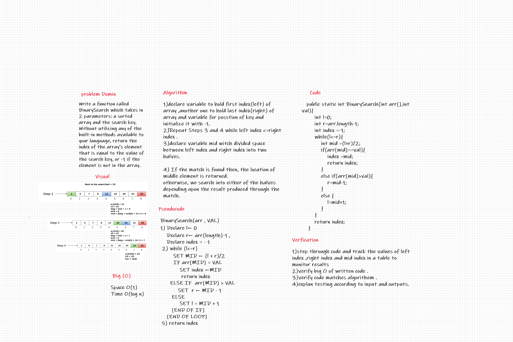

# Binary Search of Sorted Array

Write a function called BinarySearch which takes in 2 parameters: a sorted array and the search key. Without utilizing any of the built-in methods available to your language, return the index of the array’s element that is equal to the value of the search key, or -1 if the element is not in the array.

## Whiteboard Process

## Approach & Efficiency

1. declare variable to hold first index(left) of array ,another one to hold last index(right) of array and variable for posstion of key and initialize it with -1.
2. Repeat Steps 3 and 4 while left index <=right index .
3. declare variable mid witch divided space between left index and right index into two halves.
4. If the match is found then, the location of middle element is returned.
otherwise, we search into either of the halves
depending upon the result produced through the match.