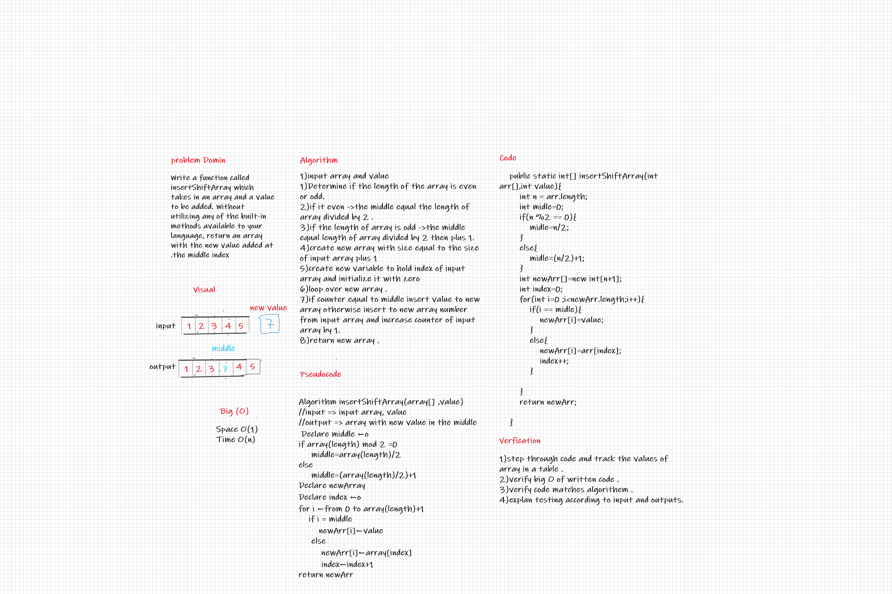

# Insert to Middle of an Array

Write a function called insertShiftArray which takes in an array and a value to be added. Without utilizing any of the built-in methods available to your language, return an array with the new value added at the middle index

## Whiteboard Process

## Approach & Efficiency

1. input array and value
1. Determine if the length of the array is even or odd.
2. if it even ->the middle equal the length of array divided by 2 .
3. if the length of array is odd ->the middle equal length of array divided by 2 then plus 1.
4. create new array with size equal to the size of input array plus 1
5. create new variable to hold index of input array and initialize it with zero
6. loop over new array .
7. if counter equal to middle insert value to new array otherwise insert to new array number from input array and increase counter of input array by 1.
8. return new array .
