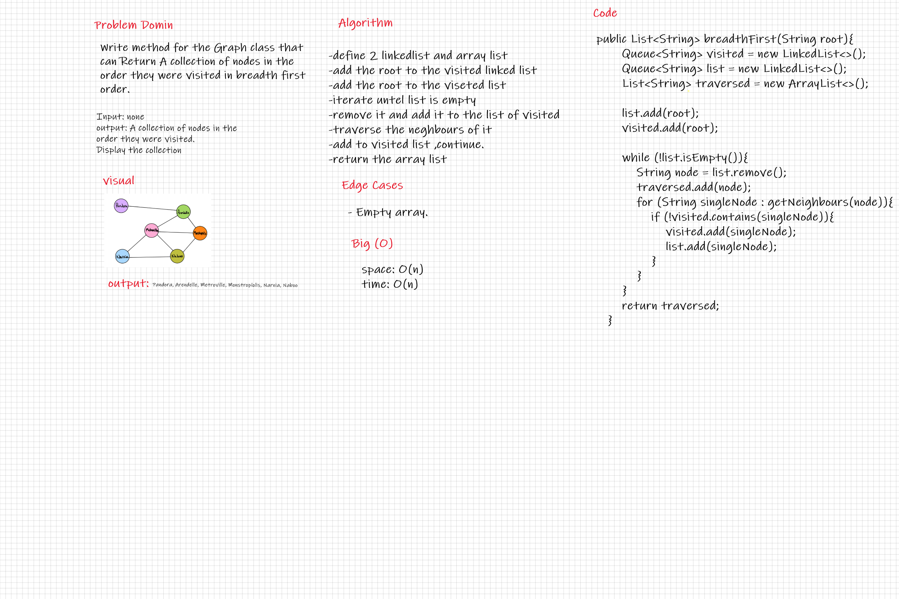

# Graphs

A Graph is a non-linear data structure consisting of nodes and edges. The nodes are sometimes also referred to as vertices and the edges are lines or arcs that connect any two nodes in the graph.

## Challenge

Implementing Graph Data structure.

## Approach & Efficiency

Implemented the graph and held the nodes of it into a hash map with type T (Generic), and Another Hash map of type T, Integer(For the weight).

## API

Class Graph :

* Member Variables:
  * Hash map nodes ```<T , <HashMap<T , Integer>>>```
* Methods :
  * addNode(T node) : adds a node to the graph (no edges specified yet).
  * addEdge(T sourceNode , T destinationNode , int weight) : adds an edge between two nodes.
  * getNodes() : returns All nodes in a graph.
  * getNeighbours(T node) : returns all neighbours of a specific graph.
  * getSize() : returns the size of the graph.

# challenge 36

* Write method for the Graph class that can Return A collection of nodes in the order they were visited in breadth first order.

## Whiteboard Process



## Approach & Efficiency

Used two Queue-Linked lists To traverse each Neighbour in the node.

## Solution

To try the method and find out that it's working, create a graph object Then add some nodes and connect them with edges and then call the method on the graph object.
