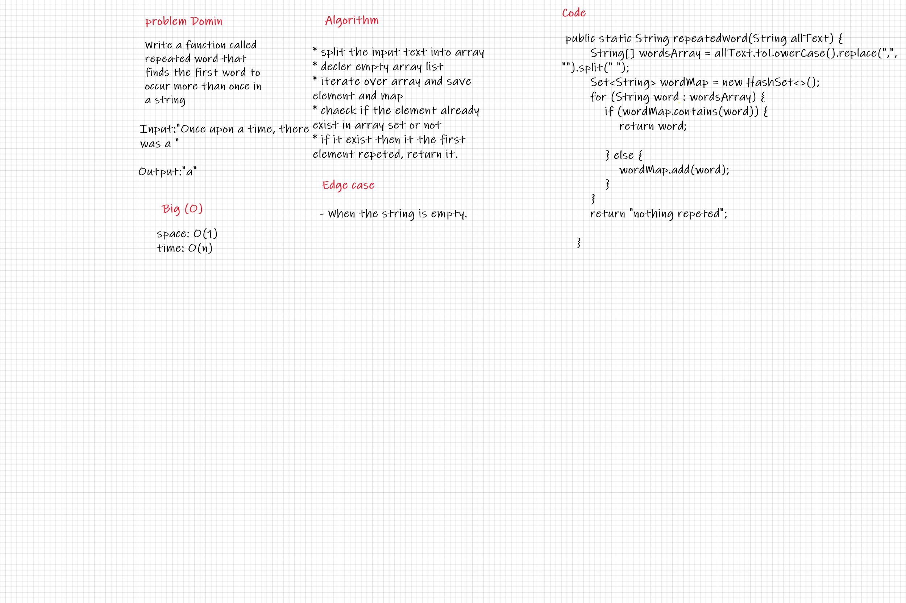
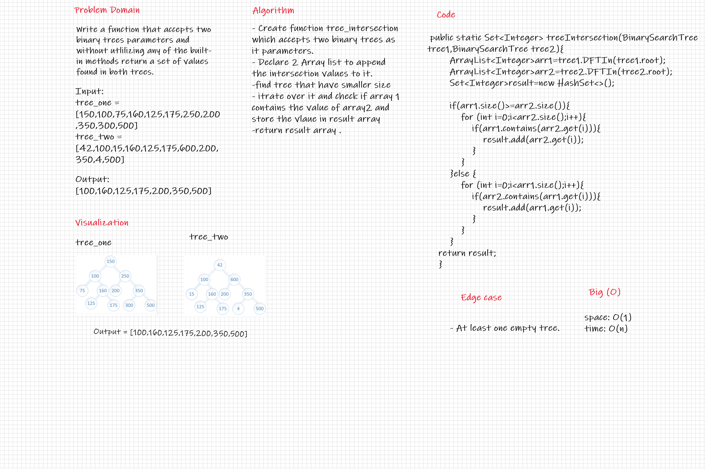

# HashTable

* Hashtables are a data structure that utilize key value pairs. This means every Node or Bucket has both a key, and a value.

## Challenge

* Implement a Hashtable Class with the following methods:
  * add
  * get
  * contains
  * hash

## Approach & Efficiency

* add method:
  * Time O(1)
  * Space O(1)
* get method :
  * Time O(n)
  * Space O(1)
* contains method:
  * Time O(n)
  * Space O(1)
* hash()
  * Time O(n)
  * Space O(1)

## API

* The class should contain the following methods:

* add method:
  * Arguments: key, value
  * Returns: nothing
  * This method should hash the key, and add the key and value pair to the table, handling collisions as needed.

* get method
  * Arguments: key
  * Returns: Value associated with that key in the table

* contains method:
  * Arguments: key
  * Returns: Boolean, indicating if the key exists in the table already.

* hash()
  * Arguments: key
  * Returns: Index in the collection for that key

# challenge 31

* Write a function called repeated word that finds the first word to occur more than once in a string

## Whiteboard Process

## Approach & Efficiency

* The Big O time complexity for method is O(n).
* The Big O space complexity for method is O(1).

## Solution

* split the input text into array
* decler empty array list
* iterate over array and save element and map
* chaeck if the element already exist in array set or not
* if it exist then it the first element repeted, return it.

# challenge 32

* Write a function to Find common values in 2 binary trees.

## Whiteboard Process

## Approach & Efficiency

* The Big O time complexity for method is O(n).
* The Big O space complexity for method is O(1).

## Solution

* Create function tree_intersection which accepts two binary trees as it parameters.
* Declare 2 Array list to append the intersection values to it.
*find tree that have smaller size
* itrate over it and check if array 1 contains the value of array2 and store the vlaue in result array 
* return result array .

