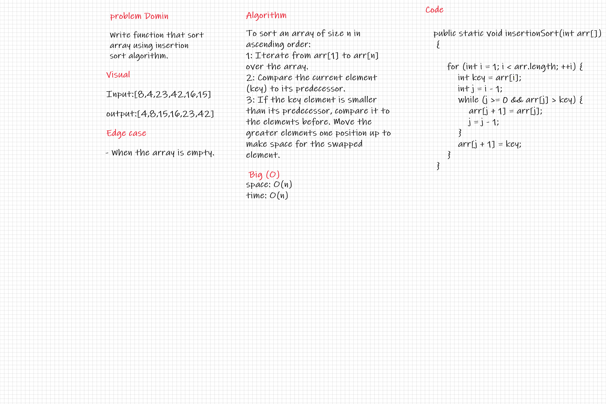

# Challenge Summary

Write function that sort array using insertion sort algorithm.

## Whiteboard Process

## Approach & Efficiency

* The Big O time complexity for sorting is O(n).
* The Big O space complexity for sorting is O(n).

## Solution

* To sort an array of size n in ascending order:

1. Iterate from arr[1] to arr[n] over the array.
2. Compare the current element (key) to its predecessor.
3. If the key element is smaller than its predecessor, compare it to the elements before.

* Move the greater elements one position up to make space for the swapped element.
