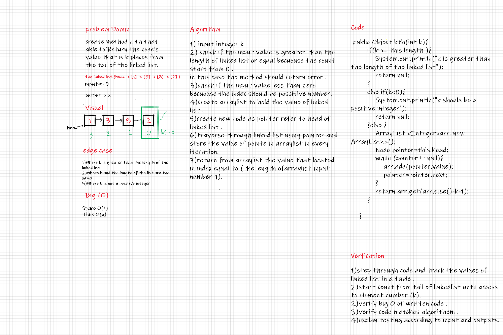

# Singly Linked List

* A singly linked list is a type of linked list that is unidirectional, that is, it can be traversed in only one direction from head to the last node (tail).

* Each element in a linked list is called a node. A single node contains data and a pointer to the next node which helps in maintaining the structure of the list.

* The first node is called the head;

## Challenge

create linked list with ability to:

* insert in it .
* find if value include in linked list or not .
* print all node of linked list .
* adds a new node with the given value to the end of the list
* adds a new node with the given new value immediately before the first node that has the value specified
* adds a new node with the given new value immediately after the first node that has the value specified.

## Approach & Efficiency

Used Classes to implement the linked list with the O(1) and O(n) for it's methods .

* insert method:
  * Time O(1)
  * Space O(1)
* include method :
  * Time O(n)
  * Space O(1)
* toString method:
  * Time O(n)
  * Space O(1)
* append()
  * Time O(n)
  * Space O(1)
* insertBefore()
  * Time O(n)
  * Space O(1)
* insertAfter()
  * Time O(n)
  * Space O(1)

## API

The class should contain the following methods:

* insert
  * Arguments: value
  * Returns: nothing
  * Adds a new node with that value to the head of the list with an O(1) Time performance.
* includes
  * Arguments: value
  * Returns: Boolean
  * Indicates whether that value exists as a Node’s value somewhere within the list.
* to string
  * Arguments: none
  * Returns: a string representing all the values in the Linked List, formatted as:
"{ a } -> { b } -> { c } -> NULL"
* append
  * Arguments: value
  * Returns: nothing
  * adds a new node with the given value to the end of the list
* insert before
  * arguments: value, new value
  * Returns: nothing
  * adds a new node with the given new value immediately before the first node that has the value specified
* insert after
  * arguments: value, new value
  * Returns: nothing
  * adds a new node with the given new value immediately after the first node that has the value specified

# kth from end

## Challenge 7:

for the Linked List class:

* create method k-th that able to Return the node’s value that is k places from the tail of the linked list. 

## Whiteboard Process

## Approach & Efficiency

1. step through code and track the values of linked list in a table .
2. start count from tail of linkedlist until access to element number (k. .
2. verify big O of written code .
3. verify code matches algorithem .
4. explan testing according to input and outputs.
