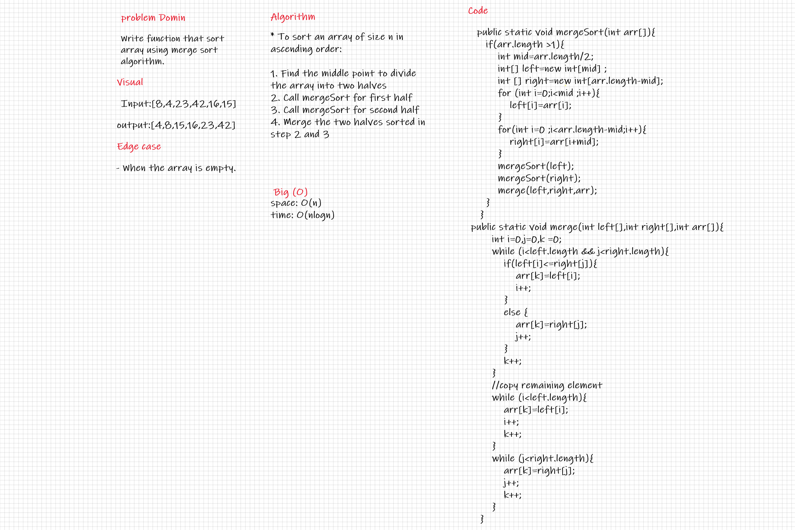

# Challenge Summary

Write function that sort array using Merge sort algorithm.

## Whiteboard Process

## Approach & Efficiency

* The Big O time complexity for sorting is O(nLogn).
* The Big O space complexity for sorting is O(n).

## Solution

* To sort an array of size n in ascending order:

1. Find the middle point to divide the array into two halves
2. Call mergeSort for first half
3. Call mergeSort for second half
4. Merge the two halves sorted in step 2 and 3

## BLOG

[blog](BLOG.md)

