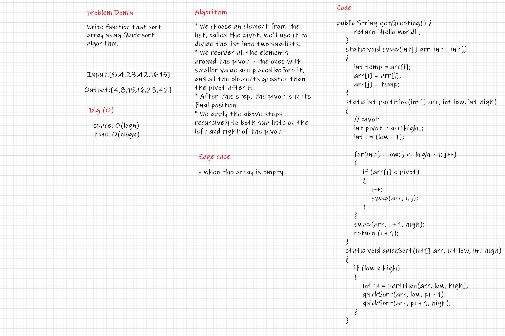

# Challenge Summary

Write function that sort array using Quick sort algorithm.

## Whiteboard Process

## Approach & Efficiency

* The Big O time complexity for sorting is O(n logn).
* The Big O space complexity for sorting is O(log n).

## Solution

* We choose an element from the list, called the pivot. We'll use it to divide the list into two sub-lists.
* We reorder all the elements around the pivot – the ones with smaller value are placed before it, and all the elements greater than the pivot after it.
* After this step, the pivot is in its final position.
* We apply the above steps recursively to both sub-lists on the left and right of the pivot

## BLOG

[blog](BLOG.md)

