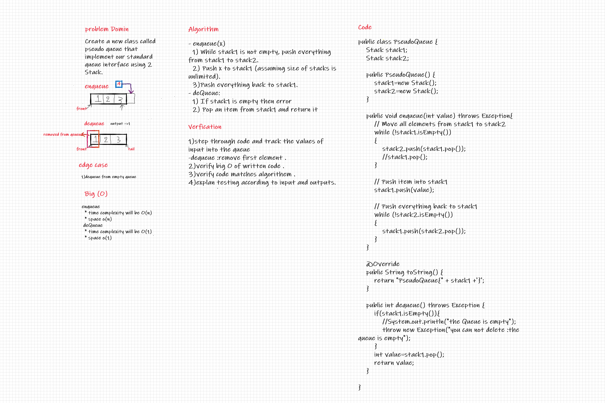
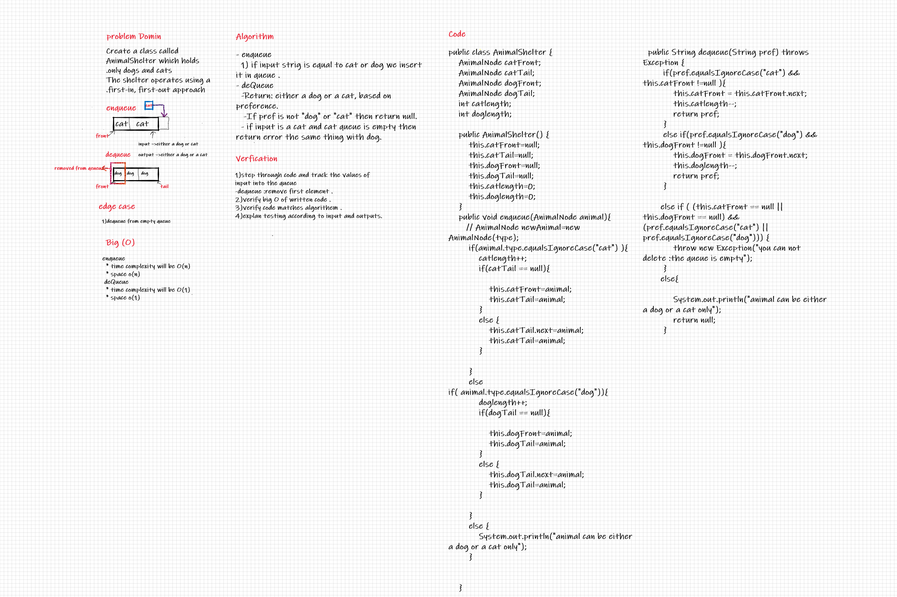
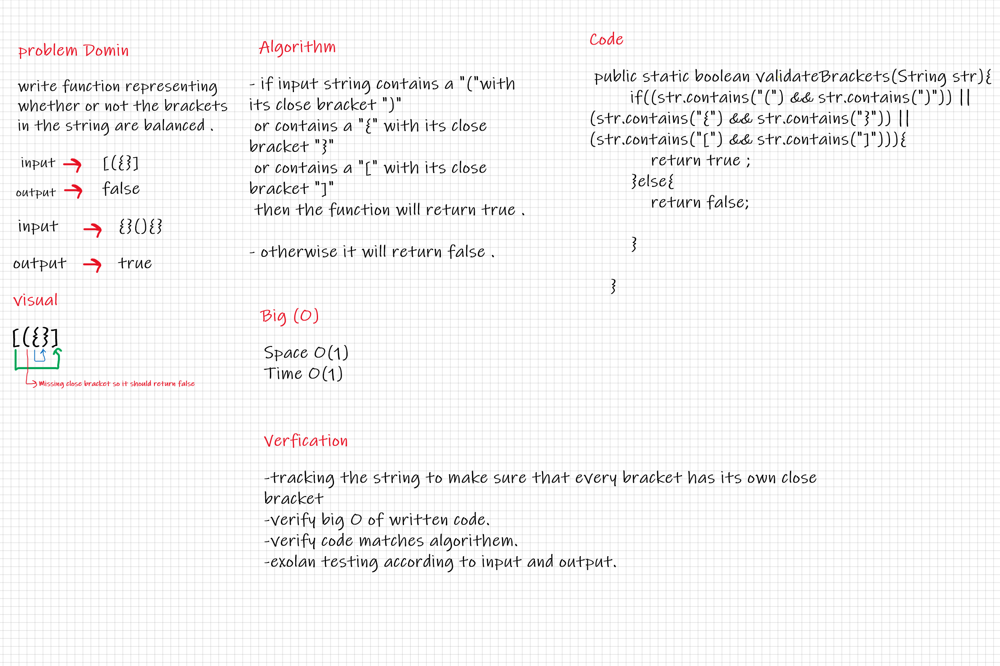

# Stacks and Queues

the program able to implement stack and queue using linked list

## Challenge #10

* Create a Stack class that has a top property.
* The class should contain the following methods:
  * push:adds a new node with that value to the top of the stack.
  * pop:Returns the value from node from the top of the stack ,Removes the node from the top of the stack
  * peek : Returns: Value of the node located at the top of the stack
  * is empty :Returns: Boolean indicating whether or not the stack is empty.
* Create a Queue class that has a front property.
* The class should contain the following methods:
  * enqueue:adds a new node with that value to the back of the queue
  * dequeue:Returns the value from node from the front of the queue Removes the node from the front of the queue
  * peek :Returns: Value of the node located at the front of the queue
  * is empty :Returns Boolean indicating whether or not the queue is empty

## Approach & Efficiency

* push method and enqueue:
  * Time O(1)
  * Space O(1)
* pop method and dequeue :
  * Time O(1)
  * Space O(1)
* peek method:
  * Time O(1)
  * Space O(1)
* is empty
  * Time O(1)
  * Space O(1)

## API

* Create a Stack class that has a top property.
* The class should contain the following methods:
  * push:adds a new node with that value to the top of the stack.
  * pop:Returns the value from node from the top of the stack ,Removes the node from the top of the stack
  * peek : Returns: Value of the node located at the top of the stack
  * is empty :Returns: Boolean indicating whether or not the stack is empty.
* Create a Queue class that has a front property.
* The class should contain the following methods:
  * enqueue:adds a new node with that value to the back of the queue
  * dequeue:Returns the value from node from the front of the queue Removes the node from the front of the queue
  * peek :Returns: Value of the node located at the front of the queue
  * is empty :Returns Boolean indicating whether or not the queue is empty

# Challenge #11

* Create a new class called pseudo queue.
  * Do not use an existing Queue.
  * Instead, this PseudoQueue class will implement our standard queue interface (the two methods listed below),
  * Internally, utilize 2 Stack instances to create and manage the queue

## Whiteboard Process

## Approach & Efficiency

* enqueue
  * time complexity will be O(n)
  * space o(n)
* deQueue
  * time complexity will be O(1)
  * space o(1)

## Solution

* enqueue(x)
  * While stack1 is not empty, push everything from stack1 to stack2.
  * Push x to stack1 (assuming size of stacks is unlimited).
  * Push everything back to stack1.
* deQueue: 
  * If stack1 is empty then error
  * Pop an item from stack1 and return it

# Challenge #12

* Create a class called AnimalShelter which holds only dogs and cats.
* The shelter operates using a first-in, first-out approach.

## Whiteboard Process

## Approach & Efficiency

* enqueue
  * time complexity will be O(1)
  * space o(1)
* deQueue
  * time complexity will be O(1)
  * space o(1)

## Solution

* enqueue
  * if input strig is equal to cat or dog we insert it in queue .
* deQueue
  * Return: either a dog or a cat, based on preference.
  * If pref is not "dog" or "cat" then return null.
  * if input is a cat and cat queue is empty then return error the same thing with dog.

# Challenge #13 validate brackets

write function representing whether or not the brackets in the string are balanced .

## Whiteboard Process

## Approach & Efficiency

* The Big O time complexity for validate brackets function is O(1).
* The Big O space complexity for validate brackets function is O(1).

## Solution

* if input string contains a ``(`` with its close bracket ``)`` or contains a ``{`` with its close bracket ``}`` or contains a ``[`` with its close bracket ``]`` then the function will return true .

* otherwise it will return false .
